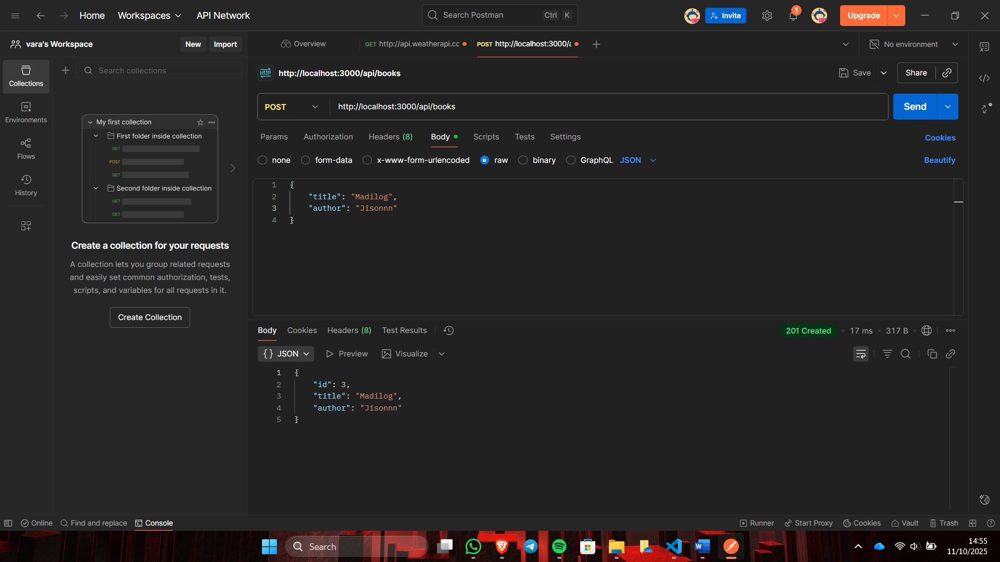
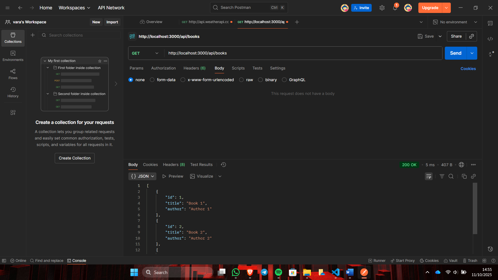
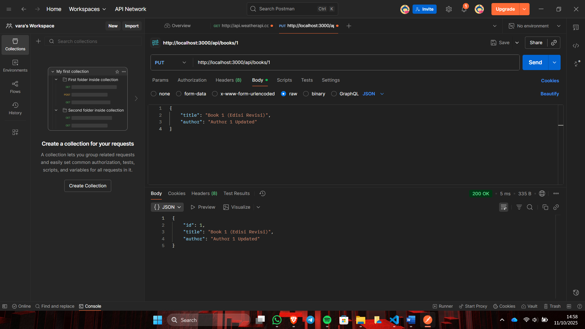
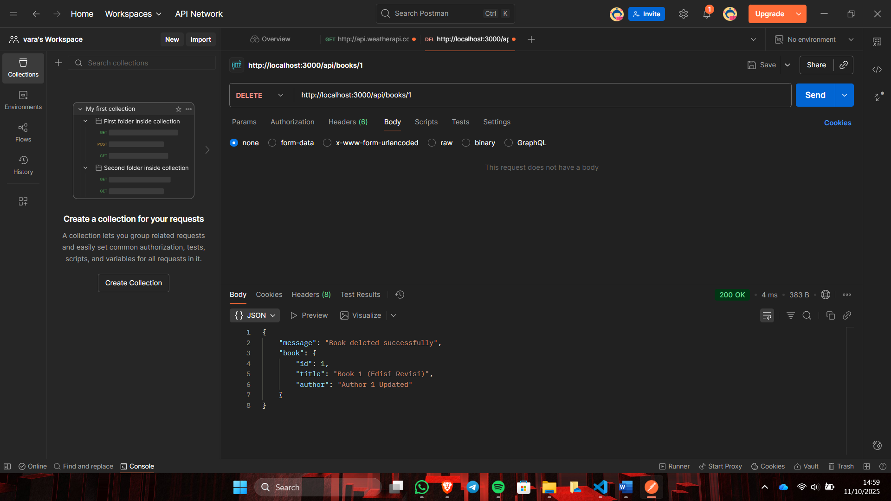

## 1. Tampilan dalam Endpoint Create Book (POST)

## 2. Tampilan dalam Endpoint Read All Books (GET)

## 3. Tampilan dalam Endpoint Update Book (PUT)

## 4. Tampilan dalam Endpoint Delete Book (DELETE)

